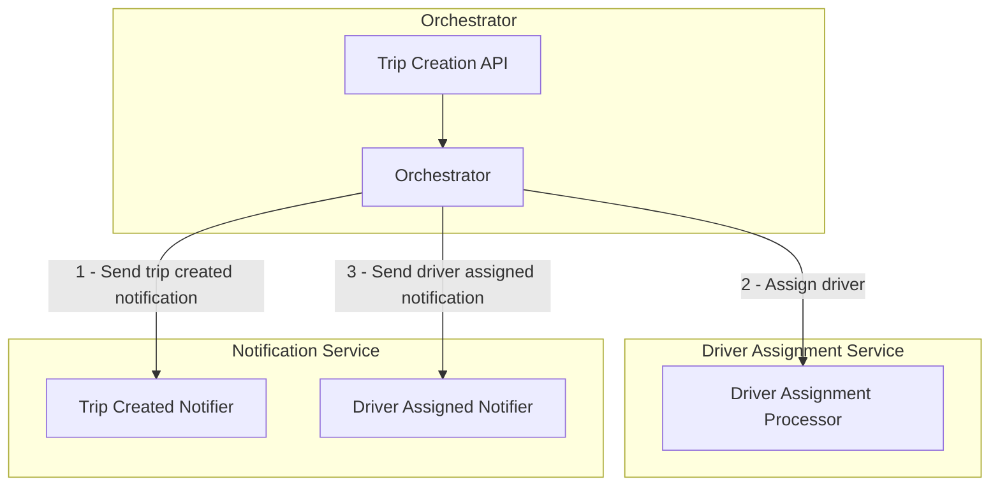
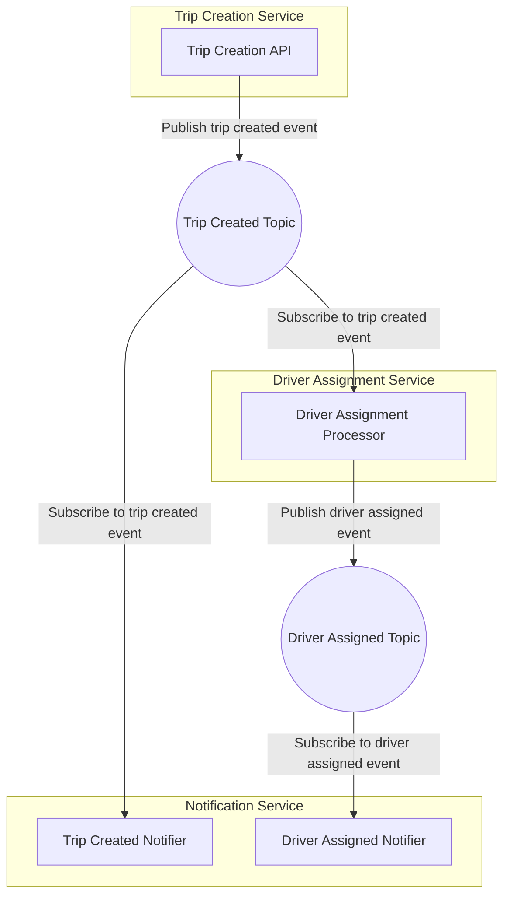

# Orchestration vs. Choreography
**Scénář:** Něco jako prvních pár kroků v něčem jako Uber. Máme API, kde dojde k objednání taxi (to by volala třeba mobilní aplikace), potřebujeme poslat notifikaci, že jsme to přijali. Pak nalézt řidiče a přiřadit ho a následně poslat notifikaci, že řidič Jarda s Toyotou je na cestě.

Podívejme se nejprve na příklad **naivní orchestrace**.



Zdrojáky jsou v ```src/or_request_trip```, ```src/or_assign_driver```a ```src/or_send_notification``` a Terraformem jsou nasazené do Azure Container Apps a můžeme si vyzkoušet, že to funguje.

**Hlavní problémy:**
- Co když orchestrátor selže někde v průběhu zpracování? Uvědomme si, že pokud příklad rozšíříme o fakturaci na konci jízdy, máme otevřené "transakce" po dobu desítek minut.
- Co když se některá z komponent změní nebo přidáme další, například vykreslování pozice čekajících zákazníků na mapě? Musíme změnit orchestrátor - riziko chyby, potenciálně přijdeme o progressive delivery nasazování, úzké hrdlo vývoje.
- Co když je některá mikroslužba dočasně nedostupná? Bude orchestrátor dělat retry? Jak dlouho a kde si bude držet informace co je rozpracované, v paměti, která nevydrží restart?
- Orchestrátor může přestat stíhat, jak ho škálovat?

Prvním řešením je **choreografie**:



Výhody:
- Asynchronní zpracování umožňuje nezávislé škálování všech komponent a dává k dispozici ideální signály (délku fronty).
- Každá komponenta je zodpovědná za svůj vlastní stav a zpracování, což zjednodušuje vývoj a nasazování.
- Výměna komponenty je snadná, stačí jen dodržet rozhraní.
- Pokud je nějaká komponenta nedostupná nebo se restartuje, není to problém. Zprávy z fronty si dobere dle potřeby kdykoli později.
- Přidání nové komponenty, například zakreslení do mapy, neznamená modifikaci ani jediné existující součástky. Trip API emituje zprávu do topicu a nezajímá ho, kdo ji bude konzumovat a co s ní bude dělat.

Nevýhody:
- Při velkém počtu komponent může být obtížné sledovat, co se děje a kde je problém. Klade to větší nároky na kvalitní monitoring.
- Tím, že není jedno místo kde se vše sbíhá, roste komplexita - začne být těžké se v tom vyznat.
- V této variantně jsou stavy (zprávy, eventy) jednorázové, pokud se někde stala chyba, není jak se vrátit zpět.

Některé nevýhody dokáže elegantně řešit **event sourcing** a **saga pattern**. Ale o tom později.

Ukázka choreografie využívá open source platformu [**DAPR**](https://dapr.io/), která je schopná zpracovávat zprávy a pub/sub komunikaci a nabízí další funkce pro distribuované systémy, které abstrahují od konkrétní technologie (Kafka, RabbitMQ, Service Bus, SQS, NATS, ...) nebo cloudu. Zdrojáky jsou v ```src/ch_request_trip```, ```src/ch_assign_driver```a ```src/ch_send_notification``` a Terraformem jsou nasazené do Azure Container Apps.

Představme si, že bychom mohli celé **workflow definovat deklarativně** z jednoho místa tak jak při orchestraci, měli i jedno místo sledování stavu všech operací, ale pod kapotou se to celé rozložilo na asynchronní zpracování velmi podobné našemu příkladu choreografie, třeba s využitím event sourcingu. Takové frameworky existují, například:
- **Azure Durable Functions** jako specifické Microsoft řešení, vhodné pro programátory
- **Azure Logic Apps** jako workflow engine s grafickým rozhraním, dostupné jak pro programátory tak pro byznys uživatele
- **Temporal** je open-source univerzální řešení pro orchestraci kódem
- **Cadence** je další open-source řešení
- **DAPR Worflow** jako open-source řešení, které můžete nasadit kamkoliv a zaměřuje se hned na několik patternů distribuovaných aplikací
- **Argo Workflows** je open-source orchestrátor specificky zaměřený na Kubernetes (používá CRD a jednotlivé kroky jsou Kubernetes Joby)
- Pro byznys procesy (není náš případ, my děláme orchestrátor jako jádro aplikace) se používá třeba **Camunda**, **Kestra**, **Airflow** nebo cloudové platformy typu **Microsoft Power Automate**, **Azure Logic Apps**, **AWS Step Functions** nebo **Google Cloud Workflows**.

Tímto způsobem můžeme získat výhody choreografie a přitom odstranit některé její nevýhody. Na druhou stranu zanášíme do systému další závislost, tentokrát na workflow orchestrační platformně.